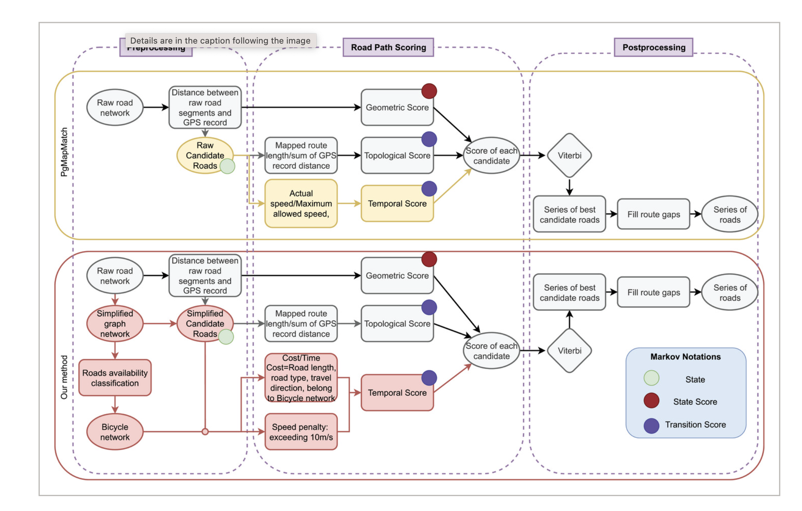

# pgMapmatching

## pgMapMatch Algorithm

### 1.Temporal likelihood

Define:

$T_{Path}: $ time needed to traverse the candidate path at the street’s speed limit.

$T_{obs}: $ the actual time gap recorded by GPS ($t_{i+1}-t_i$)

Speed ratio: $s = \frac{T_{Path}}{T_{obs}}$. So, if $x\leq 1$ means it's safe speed. $x>1$ means it needs to go faster than limit

$$
p^{\mathrm{temporal}}(s) =p(z_t,z_{t+1},t,t+1|r_{t,i},r_{t+1,j})
\begin{cases}
\mathrm{Exponential}(\lambda), & s \leq 1, \\[6pt]
\mathrm{Normal}\bigl(\mu = 1,\,\sigma_{\mathrm{temporal}}\bigr) + c, & s > 1,
\end{cases}
$$


When $s \leq 1$ : it favors shorter-than-limit times but doesn’t drop sharply near the limit, but they favour the slower rider?

When $s > 1$ : probability drops quickly as required speed exceeds limit.

### 2.Geometric Likelihood
Same as the Emission Probabilities


### 3.Topological Likelihood

$$
p^{\mathrm{topological}}(z_i,z_{i+1}|r_{t,i},r_{t+1,j}) =
\frac{\Gamma\!\left(\tfrac{21}{2}\right)}
     {\Gamma\!\left(10\right)\,\sqrt{20\pi}\,\sigma_T}
\left( 1 + \frac{{d_t}^{2}}{20\,\sigma_T^{2}} \right)^{-\tfrac{21}{2}}.
$$

$$d_t = \left| \,\left\lVert z_{t+1} - z_{t} \right\rVert_{\mathrm{great\ circle}}
      - \left\lVert x_{t+1,j^{*}} - x_{t,i^{*}} \right\rVert_{\mathrm{route}} \,\right|$$


### 4. Dijkstra’s shortest-path algorithm
Use pgr_dijkstra from the pgRouting extension of PostgreSQL to compute the shortest network (road) distance ($\lVert x_{t+1,j^{*}} - x_{t,i^{*}} \rVert_{great\ circle}$


## PostgreSQL Configuration

---

### 1. Enable PostGIS and pgRouting
```sql
CREATE EXTENSION IF NOT EXISTS postgis;
CREATE EXTENSION IF NOT EXISTS pgrouting;
\dx   
```

---

### 2. Import road network 
Our route network is a shapefile, and we want to load it into PostgreSQL.

1) In Terminal:
```bash
ogr2ogr -overwrite \
  -f "PostgreSQL" PG:"dbname=kangyuxin user=kangyuxin" \
  /Users/kangyuxin/Desktop/Mapmatching/geobase/geobase_mlt.shp\
  -nln roads \
  -nlt MULTILINESTRING
```

2) Back to PostgreSQL, convert MultiLineString  to LineString:
```sql
ALTER TABLE roads
  ALTER COLUMN wkb_geometry
  TYPE geometry(LineString, 32188)
  USING ST_LineMerge(wkb_geometry);
```

3) Turn the current road geometries into a routable network graph for pgRouting:
```sql
SELECT pgr_createTopology('roads', 0.0001, 'wkb_geometry', 'ogc_fid');
```

4) Add bicycle travel cost to roads
```sql
ALTER TABLE roads ADD COLUMN IF NOT EXISTS cost double precision;
ALTER TABLE roads ADD COLUMN IF NOT EXISTS reverse_co double precision;

UPDATE roads
SET cost = ST_Length(wkb_geometry)/1000.0/20.0,   
    reverse_co = cost
WHERE cost IS NULL OR reverse_co IS NULL;

CREATE INDEX IF NOT EXISTS roads_gix ON roads USING gist (wkb_geometry);
```

---

### 3. Import the trips (`trip10.json`)
In Terminal:
```bash
ogr2ogr -overwrite \
  -f "PostgreSQL" PG:"dbname=kangyuxin user=kangyuxin" \
  /Users/kangyuxin/Desktop/Mapmatching/trip10.json \
  -nln gps_raw \
  -nlt LINESTRING \
  -lco GEOMETRY_NAME=geom
```

---

### 4. Make Each Row Represents One GPS Coordinate Instead of a Whole Trip Line
1) Create the new per-point table
```sql
DROP TABLE IF EXISTS gps_points;

CREATE TABLE gps_points AS
SELECT
  r.id,
  (dp).path[1]                         AS pt_idx,
  (dp).geom::geometry(Point,4326)      AS geom_4326,
  r."start"::timestamptz               AS trip_start,
  r."stop"::timestamptz                AS trip_stop,
  r.purpose
FROM (
  SELECT id, "start", "stop", purpose, ST_DumpPoints(geom) AS dp
  FROM gps_raw
) AS r;

CREATE INDEX ON gps_points (id, pt_idx);
CREATE INDEX gps_points_gix_4326 ON gps_points USING gist (geom_4326);
```

2) Project points to 32188:
```sql
ALTER TABLE gps_points ADD COLUMN geom_32188 geometry(Point,32188);
UPDATE gps_points SET geom_32188 = ST_Transform(geom_4326, 32188);
CREATE INDEX gps_points_gix_32188 ON gps_points USING gist (geom_32188);
```

3) Add per-point timestamps (evenly spaced in time):
```sql
ALTER TABLE gps_points ADD COLUMN ts timestamptz;

WITH t AS (
  SELECT id, pt_idx, trip_start, trip_stop,
         MAX(pt_idx) OVER (PARTITION BY id) AS max_idx
  FROM gps_points
)
UPDATE gps_points g
SET ts = g.trip_start +
         CASE WHEN t.max_idx > 1 THEN
             ((g.pt_idx - 1)::double precision / (t.max_idx - 1)) * (g.trip_stop - g.trip_start)
           ELSE interval '0'
         END
FROM t
WHERE g.id = t.id AND g.pt_idx = t.pt_idx;
```

## Mapmatcher.py Functions


### 1. traceCleaner

Read every trace, for every consecutive pair $z_t,z_{t+1}$, compute $\left\lVert z_{t+1} - z_{t} \right\rVert_{\mathrm{great\ circle}}$ using ST_Distance and the time difference between them, and calculate the speed, if speed > $\texttt{maxSpeed}$, then drop $z_{t+1}$. And then check $(z_t, z_{t+2})$, $(z_{t+2},z_{t+3})$.


### 2. mapMathcing

(1) Candidate road search

Use ST_DWithin finds nearby roads within $\texttt{gpsError}$. And ST_Distance in PostGIS to directly compute $\lVert z_t - x_{t,i} \rVert_{\text{great circle}}$ (the shortest distance between $z_t$ and $r_{t,i}$)

ST\_Distance(geomA, geomB) returns the minimum Euclidean distance between two geometries.


(2) For each $r_{t,i}$, calculate the emission probability (geometric likelihood).

(3) Use pgr_dijkstra to calculate $\left\lVert x_{t+1,j^{*}} - x_{t,i^{*}} \right\rVert_{\mathrm{route}}$ (network distance between to road segments candidates), then we can calculate the transition probability

---


## Evaluation


## MAP-MATCHING METHOD FOR BICYCLES


### Preprocessing

(1) *Simplified graph network*: 
in Gao’s case, they reduced 67.5% of nodes and 57.9% of edges. Much faster and fewer memory

An edge is mergeable with another only if all three of the following are true:

a. they are adjacent

b. they have the same road type and direction 

c. they are not separated by an intersection (degree $\leq$ 2)

A node is any point that marks the geometry of the road network.


---

(2) *Road Classification Summary*: 

a. **Main car roads (𝕄ₒ) include:**
`motorway`
`motorway_link`
`primary`
`primary_link`
`secondary`
`secondary_link`
`tertiary`

b. **Alternative bikeable roads (𝔹) include:**
`cycleway` 
`footway`
`residential`


c. Cyclists generally avoid high-traffic roads when parallel cycleways exist,  
choosing safer and more comfortable routes with little difference in trip length.

- **Main-road distance:**  
$\displaystyle \mathcal{U}(u,v)$: the shortest path restricted to OSM main car roads

- **Bikeable distance:**  
  $\displaystyle \mathcal{B}(u,v)$: the shortest path restricted to bikeable roads


   $$
   \theta_{uv} = \frac{\mathcal{B}(u,v)}{\mathcal{U}(u,v)}, 
   \qquad
   \delta_{uv} = \big|\mathcal{U}(u,v) - \mathcal{B}(u,v)\big|.
   $$


   #### Rule 1 — Shortcut Case
   If the bikeable route is similar or shorter than the main-road route,  
   mark the main road as low-availability for cyclists when:

   $$
   \theta_{uv} \le 1.2
   $$

   #### Rule 2 — Short-Link Case
   For very short main-road segments (where ratio alone is unreliable),  
   mark the road as low-availability if both conditions hold:

   $$
   \theta_{uv} \le 2.0 
   \quad \text{and} \quad 
   \delta_{uv} \le 20\,\text{m}.
   $$


(3) *Ground-Truth Sampling and Labelling Procedure*: 

A total of 100 trajectories were from the full dataset to serve as the evaluation sample.  

They use Kolmogorov--Smirnov (K--S) test to compare three key distributions between the sampled and complete datasets to ensure that the selected subset was statistically representative:

a. GPS sampling interval,

b. trip duration, 

c.  number of GPS records per trip


Each sampled trajectory was manually inspected and labelled by a single individual using OpenStreetMap and Google Maps as references: 

a. If a dedicated parallel cycleway is available near a main road, the cyclist is assumed to use the cycleway.

b. When the time interval between two GPS points is large, the most reasonable connection is inferred from Google Maps routing, avoiding unrealistic detours or reverse movements.

c. For round trips, cyclists are assumed to use the same roads in both directions.

d. Cyclists are assumed to walk their bikes in pedestrian or shopping areas, unless multiple GPS points appear within those zones.

e. Cycling through parks or gardens is avoided unless GPS points are clearly concentrated there.

f. item Major boulevards or high-traffic crossings are avoided whenever alternative routes exist.


---

$$
\frac{\exp(s_i)}{\sum_k \exp(s_k)} 
$$

---


$$
\frac{\exp(s_i - \max_j s_j)}{\sum_k \exp(s_k - \max_j s_j)}
$$

```


